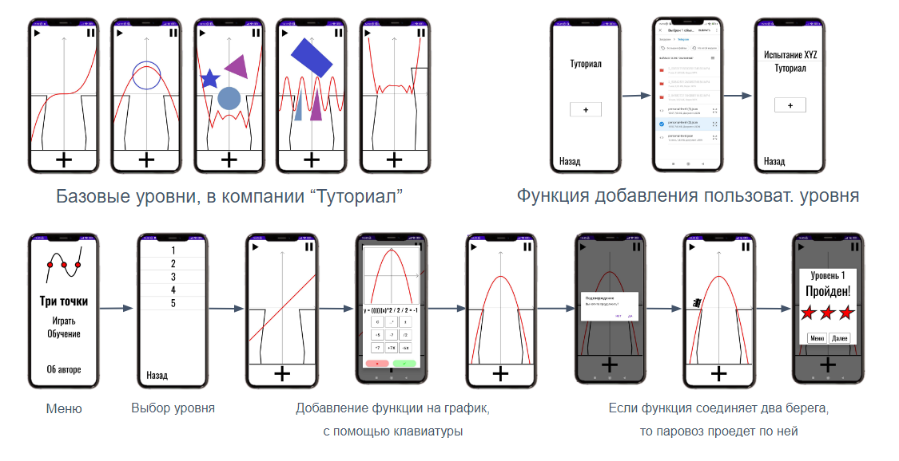

# Android приложение: Три точки

## Описание 

Три точки - игровое приложения для изучения графиков функций. Задача игрока - построить мост для паровоза, используя математические функции как инструменты для строительства.

## Пользовательский интерфейс

## Сборка

Для сборки откройте проект в IDE Android Studio 
и воспользуйтесь стандартной конфигурацией сборки.

## Ссылки 

- [Презентация](https://docs.google.com/presentation/d/1YzQbZwCT5aMNyFidXyiudX9gPJFquTCx/edit?usp=sharing&ouid=106005012759494381468&rtpof=true&sd=true)
